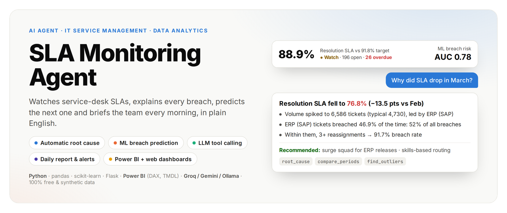
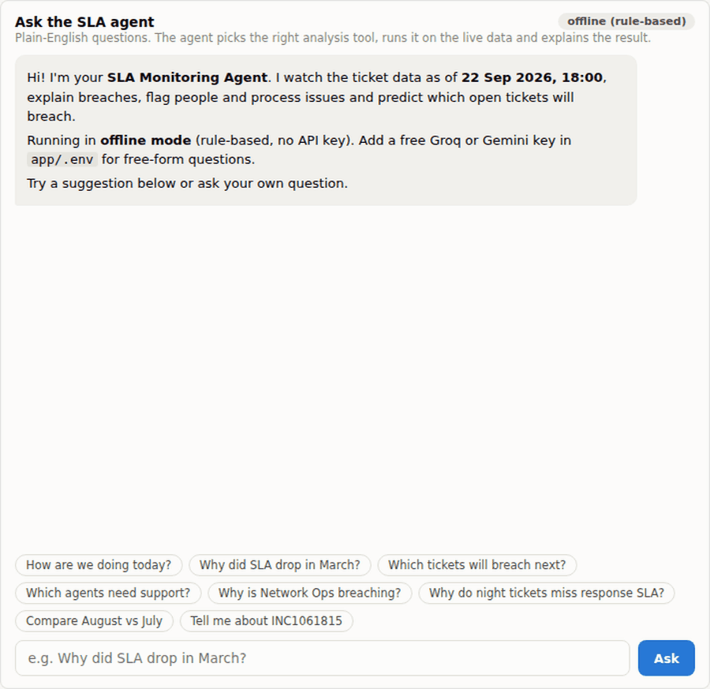
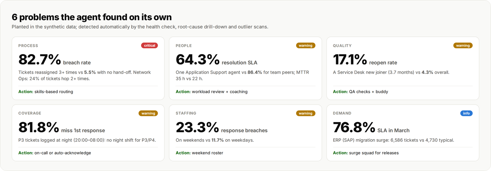
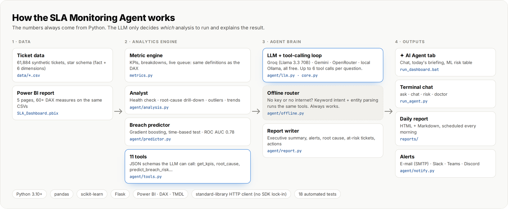
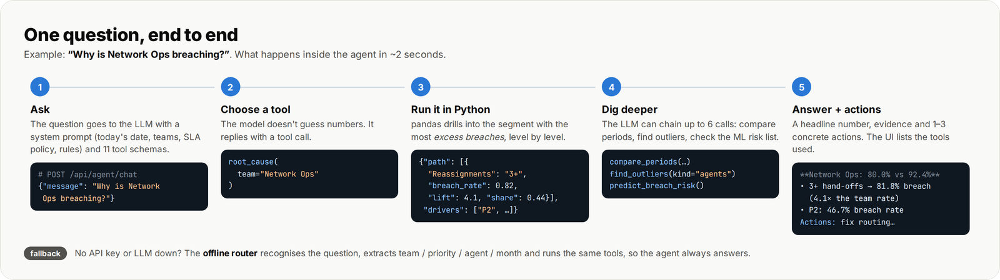
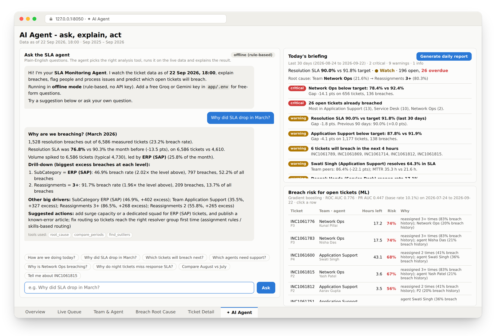
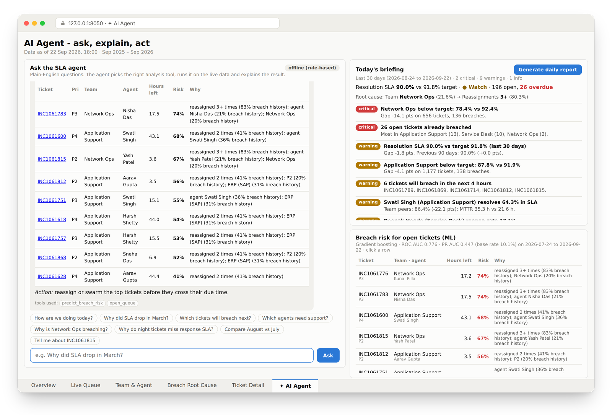
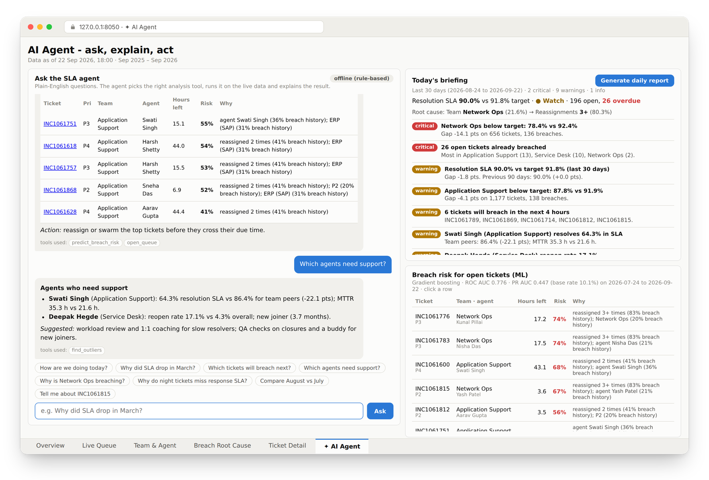
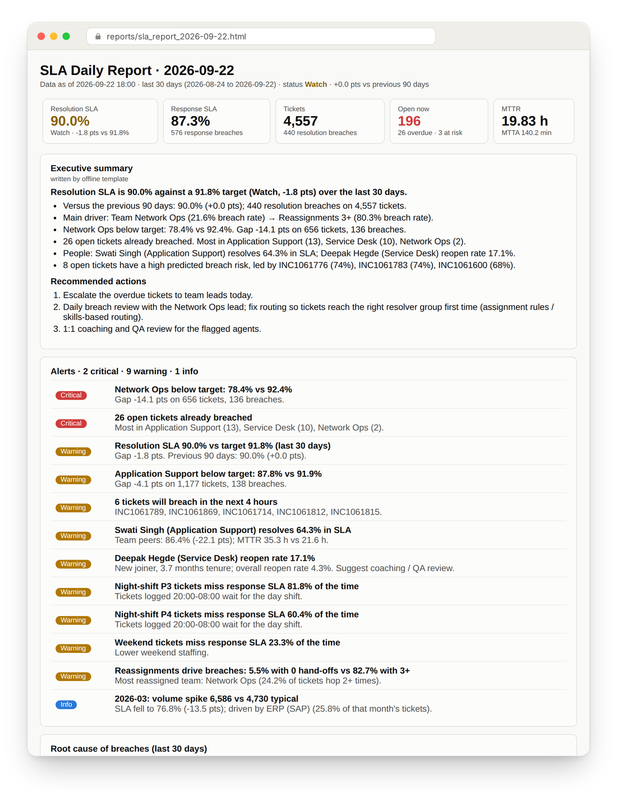

<p align="center">
  
</p>

<p align="center">
  
  
  
  
  
  
  
</p>

<p align="center">
  <a href="#-see-it-in-action">Demo</a> ·
  <a href="#-what-it-found">What it found</a> ·
  <a href="#-how-it-works">How it works</a> ·
  <a href="#-quick-start">Quick start</a> ·
  <a href="#-screenshots">Screenshots</a> ·
  <a href="#-project-structure">Structure</a>
</p>

---

**SLA Monitoring Agent** is an end-to-end analytics + AI project for an IT service desk. It doesn't just show SLA numbers. It:

- **explains** why SLAs are breached, with an automatic root-cause drill-down
- **predicts** which open tickets will breach next, using machine learning
- **briefs** the team every morning with a report and alerts
- **answers** plain-English questions through an LLM that calls analysis tools

It sits on top of two dashboards (Power BI and a Python web app). Both use the same data and the same metric definitions, so every number matches everywhere.

> Built with free tools only: Python, pandas, scikit-learn, Flask, Power BI Desktop and free LLM tiers (Groq, Gemini or a local Ollama). It also works **without any API key** in offline mode.

## 🎬 See it in action

<p align="center">
  
</p>
<p align="center"><sub>Three questions to the agent: <b>Why did SLA drop in March?</b> → <b>Which tickets will breach in the next 4 hours?</b> → <b>Which agents need support?</b> Each answer lists the analysis tools it used.</sub></p>

## 🔎 What it found

<p align="center"></p>

Six realistic problems were planted in the synthetic data. The agent's health check, root-cause drill-down and outlier scans surface **all six without being told where to look**, each with the evidence and a suggested action.

## ⚙️ How it works

<p align="center"></p>

| Capability | What happens | Code |
|---|---|---|
| **Daily health check** | Compares the last 30 days with the target and with the previous 90 days, checks every team and the live queue, and scans for risk patterns. Alerts are ranked *critical / warning / info*. | `agent/analysis.py` |
| **Automatic root cause** | A decomposition tree that picks the split explaining the most **excess breaches** at each level (team, priority, sub-category, reassignments, shift, weekday, channel, agent). | `analysis.root_cause()` |
| **Breach prediction** | Gradient boosting on ticket attributes, validated on the most recent 60 days (time-based split): **ROC AUC 0.78**, PR AUC 0.45 against a 10% base rate. Every score comes with its reasons. | `agent/predictor.py` |
| **LLM + tools** | 11 JSON-schema tools, with up to 6 tool calls per question. A standard-library client works with any OpenAI-compatible endpoint. | `agent/tools.py`, `agent/llm.py` |
| **Offline mode** | Keyword intents plus entity parsing (team, priority, agent, month) run the same tools, so the agent answers even with no key. | `agent/offline.py` |
| **Report & alerts** | Markdown and e-mail-safe HTML report, sent over SMTP, Slack, Teams or Discord, and scheduled daily with Windows Task Scheduler. | `agent/report.py`, `agent/notify.py` |

<p align="center"></p>

> **Design principle:** the LLM never calculates. It chooses *which* analysis to run and explains the result. All figures come from pandas and scikit-learn, so the agent, the web app and Power BI always agree.

## 🚀 Quick start

```bash
git clone https://github.com/abhishek-mohapatra-0/sla-monitoring-agent.git
cd sla-monitoring-agent
```

| I want to… | Windows (double-click) | Any OS |
|---|---|---|
| Open the dashboards + AI agent | `run_dashboard.bat` → http://127.0.0.1:8050 → **✦ AI Agent** | `cd app && pip install -r requirements.txt && python app.py` |
| Chat in the terminal | `run_agent_chat.bat` | `python app/run_agent.py chat` |
| Build today's report | `run_daily_report.bat` | `python app/run_agent.py report --send --open` |
| Run the report every morning | `schedule_daily_report.bat` | cron: `0 9 * * * python app/run_agent.py report --send` |
| Turn on the LLM (free) | `setup_ai_key.bat` | copy `app/.env.example` → `app/.env`, add a key |
| Open the Power BI report | `SLA_Dashboard.pbix` | Power BI Desktop (Windows) |

The first run creates `app/.venv` and installs Flask, pandas and scikit-learn, which takes 1–2 minutes. Python 3.10+ is required.

<details>
<summary><b>🔑 Turn on the LLM (optional, free)</b></summary>

1. Get a free key from [Groq](https://console.groq.com/keys) (fast, recommended) or [Google AI Studio](https://aistudio.google.com/apikey) (Gemini).
2. Run `setup_ai_key.bat`, or copy `app/.env.example` to `app/.env`, then set:
   ```ini
   LLM_PROVIDER=groq          # groq | gemini | openrouter | ollama
   LLM_API_KEY=gsk_...
   ```
3. Check it with `python app/run_agent.py doctor`. It should print `LLM test: OK`.

To stay fully local, install [Ollama](https://ollama.com), run `ollama pull qwen2.5:7b` and set `LLM_PROVIDER=ollama` (no key needed). `app/.env` is git-ignored, so your key never leaves your PC.
</details>

<details>
<summary><b>📧 E-mail / Slack / Teams alerts (optional)</b></summary>

In `app/.env`:

- **Gmail:** set `SMTP_USER`, `SMTP_PASSWORD` and `ALERT_EMAIL_TO`. The password must be a Gmail [App Password](https://myaccount.google.com/apppasswords), not your normal password.
- **Slack / Teams / Discord:** set `WEBHOOK_URL` to an incoming-webhook URL.

Then run `schedule_daily_report.bat` to get the report every morning. Scheduled runs log to `reports/agent_log.txt`.
</details>

<details>
<summary><b>📊 Power BI: point the report at your copy of the data</b></summary>

Home → Transform data → **Edit parameters** → set `DataFolder` to the full path of this repo's `data\` folder, keeping the trailing `\`. Then click **Refresh**.

`SLA_Dashboard.pbip` together with the `.Report/` and `.SemanticModel/` folders is the same report saved as text (TMDL + JSON), so reviewers can read the model and DAX right here on GitHub.
</details>

### Questions to try

| Ask | The agent runs |
|---|---|
| *How are we doing today?* | `health_check` |
| *Why did SLA drop in March?* | `root_cause` · `compare_periods` · `find_outliers` |
| *Which tickets will breach in the next 4 hours?* | `open_queue` · `predict_breach_risk` |
| *Which agents need support?* · *Who has a high reopen rate?* | `find_outliers` |
| *What is Network Ops P2 SLA last month?* | `get_kpis` |
| *Compare August vs July* · *Monthly trend for Service Desk* | `compare_periods` · `monthly_trend` |
| *Tell me about INC1061815* | `get_ticket` |

## 🖼️ Screenshots

### ✦ AI Agent

<p align="center"></p>

**The agent's home.**

- **Left:** the chat, here answering *"Why did SLA drop in March?"*. It shows the drill-down (ERP (SAP) → 3+ reassignments), the month-on-month change, the volume spike and suggested actions, and lists the tools it used (`root_cause`, `compare_periods`, `find_outliers`).
- **Top right:** *Today's briefing*, the automatic health check with a status line, the root-cause path and every alert ranked by severity.
- **Bottom right:** the ML breach-risk table, with a probability and the reasons for each open ticket.

| | |
|---|---|
|  |  |
| **"Which tickets will breach in the next 4 hours?"** It lists the tickets due soon, then ranks open tickets by predicted breach risk (74%, 68%, 67%…) with the reason for each. Clicking a ticket ID opens its detail page. | **"Which agents need support?"** It flags the slow resolver (64.3% vs 86.4% for team peers, MTTR 35 h vs 22 h) and the new joiner with a 17.1% reopen rate, with coaching actions. |

### 📨 Daily report

<p align="center"></p>

This is generated every morning (`run_daily_report.bat` / Task Scheduler) and e-mailed or posted to chat. It contains:

- KPI tiles
- an **executive summary with recommended actions**, written by the LLM, or by a template when offline
- ranked alerts
- the root-cause chain
- the open tickets most likely to breach

The HTML uses tables and inline styles only, so it renders the same in Gmail and Outlook. See the [sample report](docs/sample_report/sla_report_2026-09-22.md).

### Power BI dashboard

The report has 5 pages with a navigation bar, a star-schema model and 60+ DAX measures (weighted SLA target, `USERELATIONSHIP` on the resolved date, status icons + labels).

| | |
|---|---|
|  |  |
| **Overview.** Six KPI tiles with status, SLA by month against the priority-weighted target (the March dip is the ERP surge), SLA by priority with target ticks, created vs resolved, and a team scorecard. | **Live Queue.** 196 open tickets by team and SLA status, backlog ageing, and a *tickets to action* list sorted by hours to breach. Right-click a ticket to drill through to its detail page. |
|  |  |
| **Team & Agent.** A team scorecard that expands to agents, an agent leaderboard (weakest first), an agent volume-vs-SLA scatter and the reopen trend. | **Breach Root Cause.** A decomposition tree, breach rate by number of reassignments (5.5% → 82.7%), a weekday × hour response heatmap (night and weekend hot spots) and a rolling 30-day SLA. |

### Python web dashboard

These are the same pages rebuilt in Flask + pandas with hand-made SVG charts. The Date, Priority, Team and Channel filters apply to every page, and you can click to drill into any team, bar or ticket.

| | |
|---|---|
|  |  |
| **Overview.** The same KPIs as Power BI, which is a built-in cross-check that the pandas engine matches the DAX. | **Live Queue.** Overdue tickets at the top (negative hours to breach). Click any row to open the ticket. |
|  |  |
| **Team & Agent.** Application Support is expanded, with Swati Singh selected: 64.3% SLA and a −27.6 pts gap, and her reopen trend on the right. | **Breach Root Cause.** Drilled into *Team: Network Ops*, where P2 tickets breach 46.7% of the time; reassignments and heatmap alongside. |

<p align="center"></p>
<p align="center"><sub><b>Ticket Detail.</b> The full timeline of one ticket: created, response due, first response (in time?), resolution due and resolved.</sub></p>

## 🗂️ Project structure

```
sla-monitoring-agent/
├── app/
│   ├── agent/                  ← the AI agent
│   │   ├── core.py             SLAAgent: chat(), briefing(), daily_report(); system prompt
│   │   ├── tools.py            11 tools + JSON schemas the LLM can call
│   │   ├── analysis.py         health check, root-cause drill-down, outliers, trends
│   │   ├── predictor.py        breach-risk model (scikit-learn gradient boosting)
│   │   ├── llm.py              OpenAI-compatible client + tool-calling loop (stdlib only)
│   │   ├── offline.py          rule-based router + answer templates (no key needed)
│   │   ├── report.py           daily report → Markdown + e-mail-safe HTML
│   │   ├── notify.py           SMTP e-mail + Slack / Teams / Discord webhooks
│   │   └── config.py           reads app/.env, provider presets
│   ├── metrics.py              SLA metric engine shared by the dashboards and the agent
│   ├── app.py                  Flask server: dashboard API + agent API
│   ├── run_agent.py            CLI: chat · ask · report · risk · doctor
│   ├── templates/ · static/    web UI (SVG charts, chat UI)
│   └── .env.example            settings template
├── data/                       7 star-schema CSVs (61,884 synthetic tickets)
├── scripts/                    generate_tickets.py (data generator) · setup_env.bat
├── powerbi/                    DAX_Measures.dax · SLA_Theme.json · BUILD_GUIDE.md
├── SLA_Dashboard.pbix / .pbip  Power BI report (+ text project folders)
├── tests/test_agent.py         18 tests
├── docs/                       images, screenshots, sample report
└── *.bat                       one-click launchers (dashboard, chat, report, scheduler, key setup)
```

<details>
<summary><b>API reference</b></summary>

**Agent**

| Endpoint | Returns |
|---|---|
| `POST /api/agent/chat` `{"message": "...", "history": [...]}` | answer, tools used, mode |
| `GET /api/agent/briefing` | full health check (alerts, root cause, KPIs) |
| `GET /api/agent/risk?limit=10` | ML breach risk for open tickets + model metrics |
| `POST /api/agent/report?send=1` | builds (and sends) the daily report |

**Dashboard** (each accepts `start`, `end`, `team`, `priority`, `channel`)

`GET /api/meta` · `/api/overview` · `/api/queue` · `/api/people?agent=` · `/api/rootcause` · `/api/breakdown?path=Team:Network%20Ops&dim=Priority` · `/api/ticket/<id>`
</details>

## 📐 Data & SLA policy

The data is a synthetic star schema: `FactTickets` plus `DimPriority`, `DimTeam`, `DimAgent`, `DimCategory`, `DimDate` and `DimSnapshot`. It covers Sep 2025 – Sep 2026, with a snapshot time of 22 Sep 2026 18:00. You can regenerate it with `python scripts/generate_tickets.py --seed 42`.

| Priority | First response | Resolution | Target |
|---|---|---|---|
| P1 Critical | 15 min | 4 h | 98% |
| P2 High | 30 min | 8 h | 95% |
| P3 Medium | 2 h | 24 h | 92% |
| P4 Low | 8 h | 72 h | 90% |

Headline (all data): **88.9%** resolution SLA vs a 91.8% weighted target (*Watch*) · response SLA 87.1% · 61,884 tickets · 6,871 breaches · 196 open (26 overdue) · MTTR 21.4 h · CSAT 4.04.

## ✅ Tests

```bash
pip install pytest
python -m pytest -q        # 18 passed
```

The tests cover:

- the KPIs match the dashboards
- all six patterns are detected
- the March root cause is ERP
- the ML model's AUC is above 0.7
- the offline router picks the right tools
- the **LLM tool-calling loop** works end to end against a fake OpenAI-compatible server
- the agent falls back to offline mode when the LLM is down
- the report files are written and the web API responds

A full walkthrough, including rebuilding the Power BI report from scratch, is in **[STEP_BY_STEP_GUIDE.md](STEP_BY_STEP_GUIDE.md)**.

---

<sub>All data is synthetic and generated by <code>scripts/generate_tickets.py</code>. No real company or customer data is used. Built by Abhishek Mohapatra as a portfolio project.</sub>
