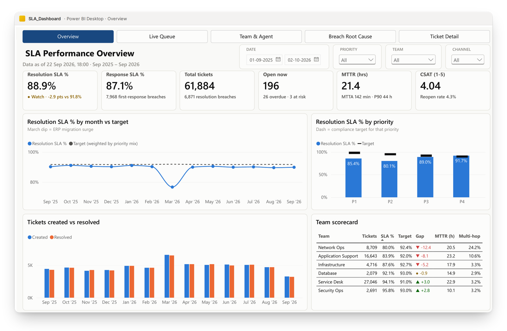
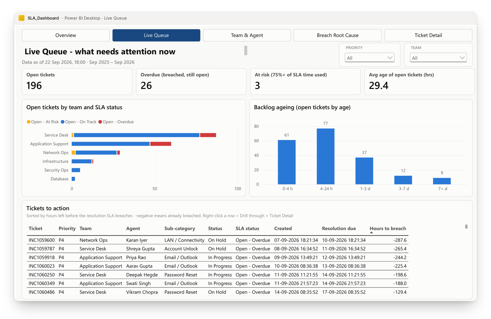
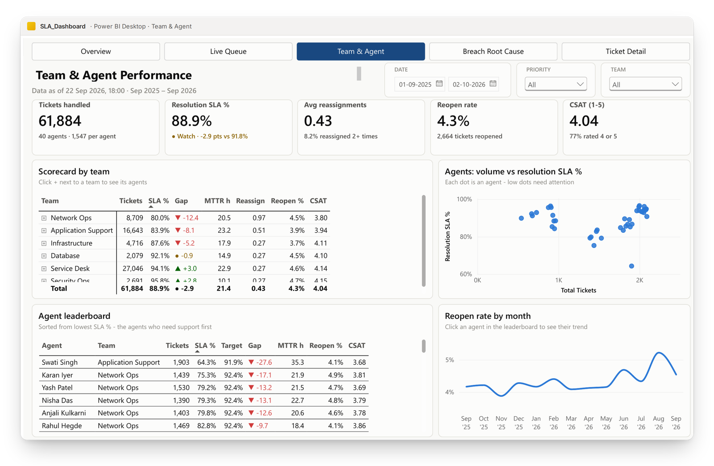
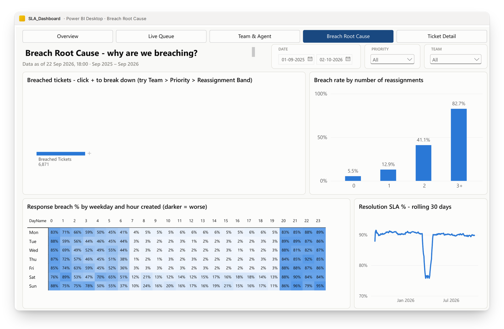
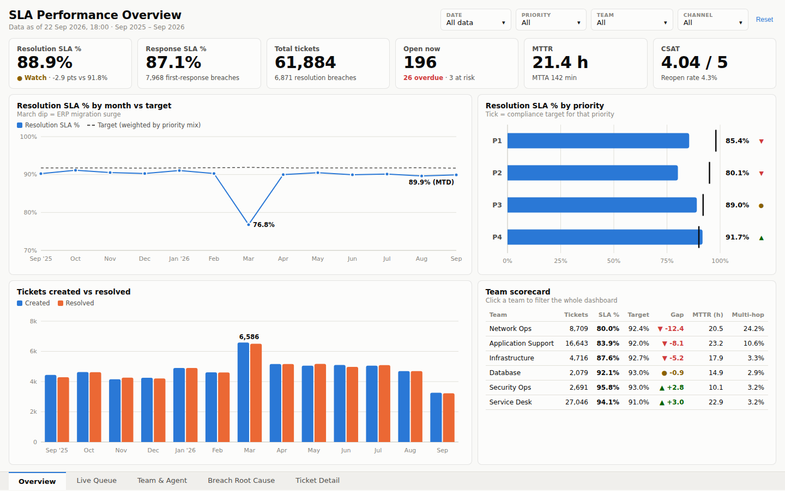
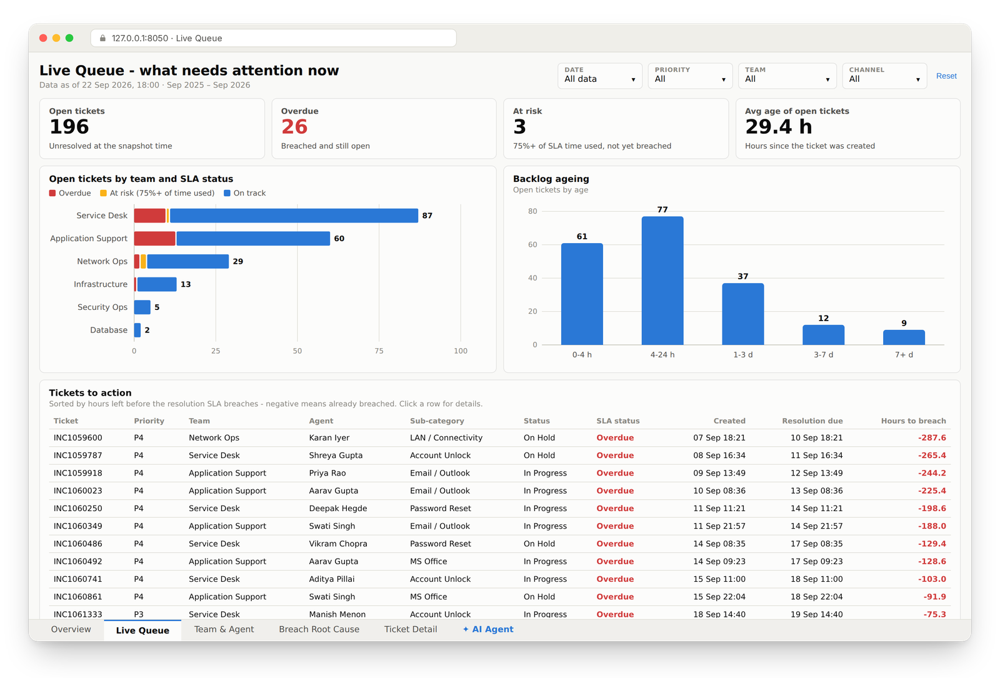
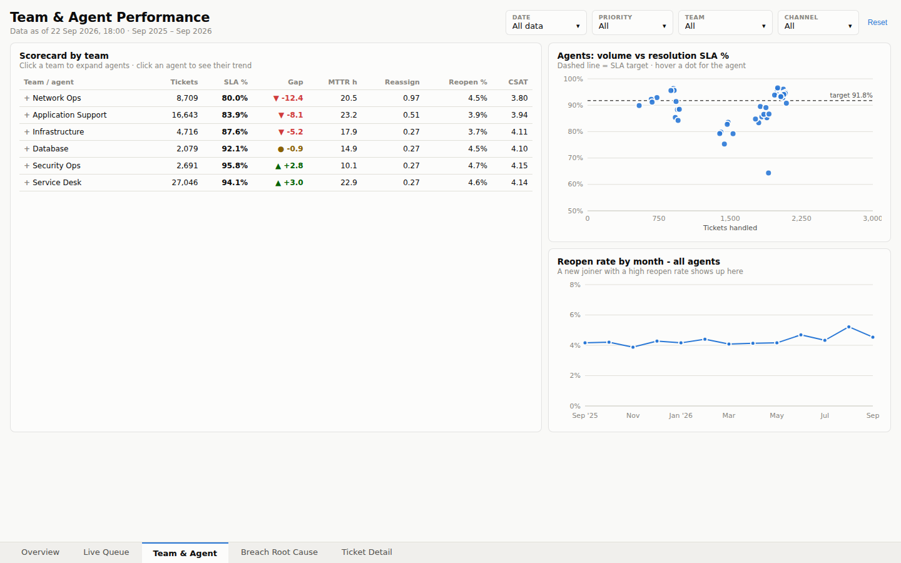
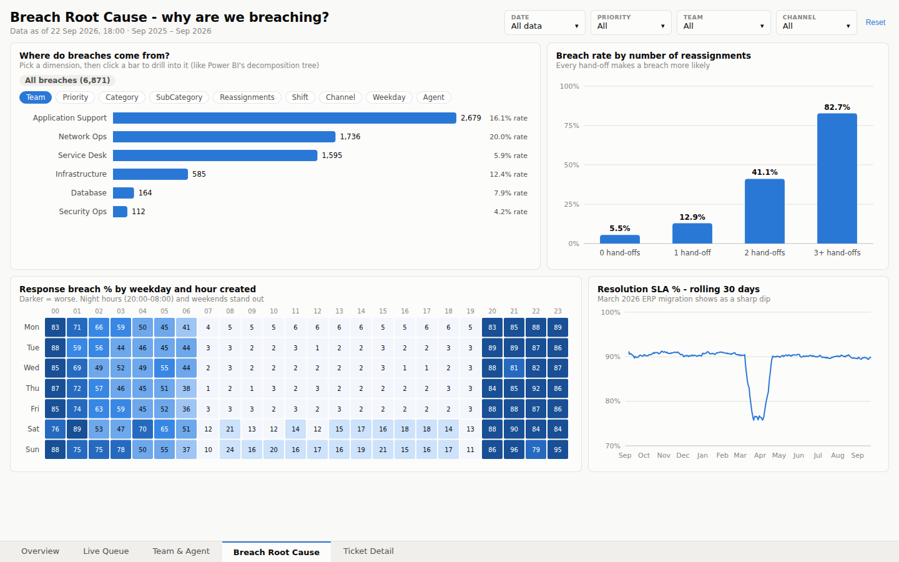
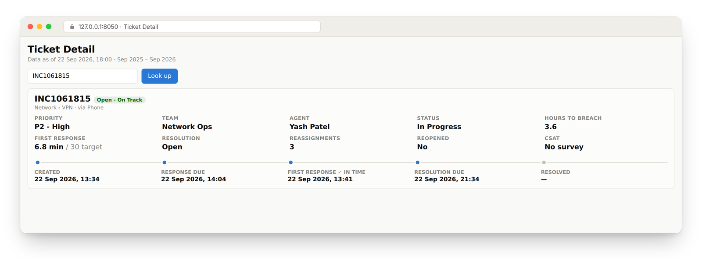
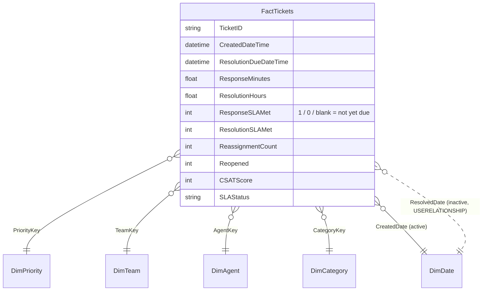

# SLA Monitoring Agent

An end-to-end SLA monitoring solution for an IT service desk. It has two dashboards built on the same data and the same metric definitions:

- a **Power BI dashboard** with 5 pages, a star-schema model and 60+ DAX measures
- a **Python web dashboard** (Flask + pandas, hand-built SVG charts)

An **AI agent** (Phase 2) will reuse the Python metric engine to explain breaches, send alerts and answer questions in plain English.




---

## Contents

- [What it answers](#what-it-answers)
- [Screenshots](#screenshots)
- [Quick start](#quick-start)
- [Project structure](#project-structure)
- [Data model](#data-model)
- [SLA policy and key metrics](#sla-policy-and-key-metrics)
- [Insights hidden in the data](#insights-hidden-in-the-data)
- [Roadmap: the agent (Phase 2)](#roadmap-the-agent-phase-2)

---

## What it answers

| Page | Question | Highlights |
|---|---|---|
| **Overview** | Are we meeting SLA? | 6 KPI tiles with status, monthly trend vs a weighted target, SLA by priority with target ticks, created vs resolved, team scorecard |
| **Live Queue** | What needs attention right now? | Open tickets by team and SLA status, backlog ageing, a "tickets to action" list sorted by hours to breach |
| **Team & Agent** | Who needs support? | Team scorecard that expands to agents, an agent leaderboard, volume vs SLA scatter, reopen trend |
| **Breach Root Cause** | Why are we breaching? | Decomposition tree, breach rate by reassignment count, weekday × hour heatmap, rolling 30-day SLA |
| **Ticket Detail** | What happened to this one ticket? | Drill-through page with the full ticket timeline |

## Screenshots

### Power BI

| Overview | Live Queue |
|---|---|
|  |  |
| **Team & Agent** | **Breach Root Cause** |
|  |  |

### Python web dashboard

| Overview | Live Queue |
|---|---|
|  |  |
| **Team & Agent** | **Breach Root Cause** |
|  |  |



---

## Quick start

### 1. Get the code

```bash
git clone https://github.com/abhishek-mohapatra-0/sla-monitoring-agent.git
cd sla-monitoring-agent
```

You can also click **Code → Download ZIP** and extract it.

### 2a. Open the Power BI dashboard

Requirements: [Power BI Desktop](https://powerbi.microsoft.com/desktop/) (free, Windows).

1. Double-click **`SLA_Dashboard.pbix`**. It opens with data already loaded, so you can explore right away.
2. **Refresh with your own copy of the data (needed once after cloning):**
   Home → Transform data ▾ → **Edit parameters** → set **`DataFolder`** to the full path of this repo's `data` folder. Keep the trailing backslash, for example `C:\Projects\sla-monitoring-agent\data\`. Then click OK → **Refresh**.
3. Move between pages with the navigation bar at the top. In Desktop's edit mode, hold **Ctrl** while clicking.
4. Drill through to a ticket: on **Live Queue**, right-click a ticket → **Drill through → Ticket Detail**.

> `SLA_Dashboard.pbip` together with the `SLA_Dashboard.Report/` and `SLA_Dashboard.SemanticModel/` folders is the same report saved as a **Power BI Project**: plain-text TMDL and JSON files, so you can review the model and DAX on GitHub. Open the `.pbip` in Power BI Desktop to use it. The first refresh rebuilds the local cache.

### 2b. Run the Python web dashboard

Requirements: Python 3.10+.

**Windows, one click:** double-click **`run_dashboard.bat`**. The first run creates `app\.venv` and installs the packages, which takes about a minute. Then open <http://127.0.0.1:8050>.

**Any OS:**

```bash
cd app
python -m venv .venv
# Windows: .venv\Scripts\activate    macOS/Linux: source .venv/bin/activate
pip install -r requirements.txt
python app.py
```

Then open <http://127.0.0.1:8050>. Filters for Date, Priority, Team and Channel apply to every page. Click a team, a bar or a ticket to drill in.

**JSON API** (the same endpoints the agent will call):

| Endpoint | Returns |
|---|---|
| `GET /api/meta` | filter options and the as-of time |
| `GET /api/overview?team=Network%20Ops&priority=P2` | KPI tiles, trend, by-priority, created vs resolved, scorecard |
| `GET /api/queue` | open tickets, backlog ageing, tickets to action |
| `GET /api/people?agent=Swati%20Singh` | team/agent scorecard, scatter, reopen trend |
| `GET /api/rootcause` | reassignment breach rate, heatmap, rolling 30-day SLA |
| `GET /api/breakdown?path=Team:Network%20Ops&dim=Priority` | one level of the breach decomposition tree |
| `GET /api/ticket/INC1059600` | a single ticket |

### 3. (Optional) Regenerate the data

```bash
pip install numpy pandas
python scripts/generate_tickets.py --seed 42 --out data
```

Different seeds give different numbers, but the six built-in patterns are still there.

For a guided walkthrough, including rebuilding the Power BI report from scratch, see **[STEP_BY_STEP_GUIDE.md](STEP_BY_STEP_GUIDE.md)**.

---

## Project structure

```
sla-monitoring-agent/
├── SLA_Dashboard.pbix              Power BI report (data included)
├── SLA_Dashboard.pbip              Power BI Project entry point
├── SLA_Dashboard.Report/           report pages & visuals as JSON (PBIR)
├── SLA_Dashboard.SemanticModel/    tables, relationships, measures as TMDL
├── data/                           7 star-schema CSVs (61,884 tickets)
├── scripts/
│   └── generate_tickets.py         synthetic data generator (numpy + pandas)
├── powerbi/
│   ├── DAX_Measures.dax            every measure & calculated column, commented
│   ├── SLA_Theme.json              report theme
│   ├── BUILD_GUIDE.md              design spec: pages, visuals, expected numbers
│   └── mockup_overview.png         original design mockup
├── app/                            Python web dashboard
│   ├── app.py                      Flask server + JSON API
│   ├── metrics.py                  SLA engine (KPIs, breakdowns, queue) - agent tools
│   ├── requirements.txt
│   ├── templates/index.html
│   └── static/                     style.css · charts.js (SVG charts) · app.js
├── docs/screenshots/               images used in this README
├── run_dashboard.bat               one-click launcher for the web app (Windows)
└── STEP_BY_STEP_GUIDE.md           how to use / rebuild everything
```

## Data model

A star schema with one fact table and six dimensions. Everything is synthetic, covering Sep 2025 – Sep 2026, with a snapshot time of 22 Sep 2026 18:00.



`DimSnapshot` holds the single as-of timestamp that drives "hours to breach" and backlog age.

## SLA policy and key metrics

| Priority | First response | Resolution | Compliance target |
|---|---|---|---|
| P1 Critical | 15 min | 4 h | 98% |
| P2 High | 30 min | 8 h | 95% |
| P3 Medium | 2 h | 24 h | 92% |
| P4 Low | 8 h | 72 h | 90% |

SLA clocks run 24×7. The overall target is **weighted by the priority mix** in the current filter.

| KPI (all data) | Value |
|---|---|
| Resolution SLA % | **88.9%** vs 91.8% target (status: *Watch*) |
| Response SLA % | 87.1% |
| Tickets | 61,884 (6,871 resolution breaches) |
| Open now | 196 (26 overdue, 3 at risk) |
| MTTR / MTTA | 21.4 h / 142 min |
| CSAT · Reopen rate | 4.04 / 5 · 4.3% |

The Power BI (DAX) and Python (pandas) versions return identical numbers.

DAX lessons that are documented in `powerbi/DAX_Measures.dax`:

- Use `==` instead of `=` when testing for 0, because `BLANK() = 0` is TRUE in DAX. Otherwise open tickets get counted as breaches.
- A sort-by column cannot depend on the column it sorts, because that creates a circular dependency.
- Resolved-date charts use `USERELATIONSHIP` over an inactive relationship.

## Insights hidden in the data

The generator plants six realistic problems. The dashboard and the agent should surface them:

1. **Network Ops P2 tickets bounce between teams.** The breach rate climbs from ~6% with 0 hand-offs to ~83% with 3+.
2. **One Application Support agent** runs at ~64% SLA, while the team average is ~84%.
3. **A Service Desk new joiner** (hired Jun 2026) has a ~17% reopen rate.
4. **Night-time P3 tickets** (20:00–08:00) miss the response SLA because there is no night shift for P3/P4.
5. **Weekends** respond more slowly.
6. **An ERP migration surge in March 2026** causes a volume spike and an SLA dip to ~77%.

## Roadmap: the agent (Phase 2)

- [x] Synthetic data + star schema
- [x] Power BI dashboard (5 pages, drill-through, navigation)
- [x] Python dashboard + JSON API + reusable metric engine (`app/metrics.py`)
- [ ] **SLA agent** (free LLM via Groq / Gemini / Ollama) with `metrics.py` functions as tools:
  - daily check: is Resolution SLA % below target?
  - automatic root-cause drill-down (Team → Priority → Reassignments …)
  - plain-English summary sent to email / Slack / Teams
  - chat Q&A: *"Why did SLA drop in March?"*, *"Which tickets breach in the next 4 hours?"*
- [ ] Breach prediction for open tickets

---

*All required raw data in this repository is synthetic and generated by AI. No real company or customer data is used.*
